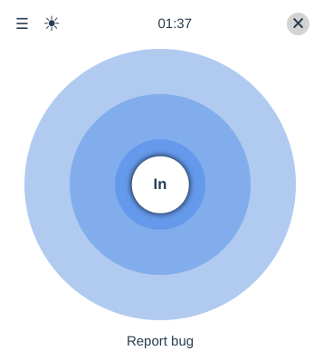
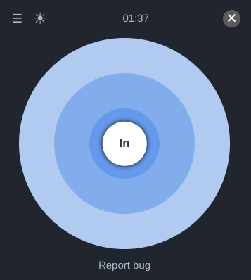

<!-- markdownlint-disable -->

<h1 align="center">
   
  Breathing
</h1>

<strong>Relax, meditate and breathe your way to wellness</strong>

  
  

  

  

<!-- markdownlint-enable -->
<!-- markdownlint-disable headings -->

**Breathing** is a simple application to help you relax. We all face unnerving
situations sometimes. Perhaps you are preparing for an exam, an interview, your
first conference talk, or a life-changing activity which makes you nervous.
We all experience that feeling. Sometimes just breathing in and out is what
you need. It helps calm you down and soothe your nerves. And that is
the purpose of this application. Breathing helps you relax by breathing in and out.

This is the browser extension version of the linux desktop application
[Breathing](https://github.com/SeaDve/Breathing) which, was created and designed
by [Dave Patrick](https://github.com/SeaDve). You can also download the desktop
application on [Flathub](https://flathub.org/apps/details/io.github.seadve.Breathing)
if you use **GNOME** desktop environment.

## Contributing

If you find this app useful, do consider contributing. If you are wondering how,
you can contribute in the following ways.

- You can translate to your local language. Be sure to first check whether your
 language is [supported](https://developer.chrome.com/docs/webstore/i18n/#choosing-locales-to-support).
- You can rate us on the app store or star the project repository on GitHub.
- Report bugs if you encounter some. There are probably a handful of them.
- You can also contribute code. If it is a bug fix do open a pull request(PR). However,
if it is a new feature, first open an issue so that we discuss before opening a PR.

## Run project locally

To run this project locally, clone this repository and load the unpacked extension
in a chromium-based browser like Chrome, Opera, Edge or Brave. You can follow
this guide on [loading upacked extension in chrome](https://developer.chrome.com/docs/extensions/mv3/getstarted/#unpacked).
Be aware the process might be slightly different for the other browsers and be sure
to load the extension in the [chromium directory](./extensions/chromium/).You will
get an error if you attempt to load the same directory in Firefox because
Firefox doesn't support MV3 yet.

## License

Breathing is a [free software](https://www.gnu.org/philosophy/free-sw.html) and
will always be free. It is released under the terms of the
[GNU General Public License v3.0](./LICENSE).

## Copyright

Copyright © [Joseph Mawa](https://github.com/nibble0101) and [Dave Patrick](https://github.com/SeaDve).
